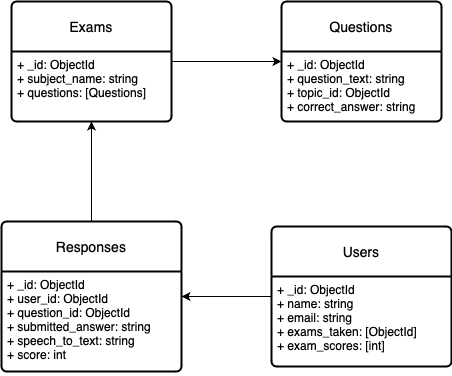

# **AI-Powered Pre-Calculus Grading System** 🌱🧪

## **Overview** 📖

Welcome to our **AI-powered Pre-Calculus Grading System**! ✨ This project is designed to help students practice and certify their Pre-Calculus knowledge with the help of **AI**. Students can take exams, submit their answers (both written and spoken 🎤), and get instant feedback. It's like having your own personal math coach 👨‍🏫!

### **Features** 🥇
- Store a collection of **Pre-Calculus questions** 🧐.
- Students can submit **written answers** and **spoken explanations** 🖋️🎙️.
- Uses **speech-to-text conversion** to evaluate spoken answers 🎧.
- **AI grading** for both written and spoken responses ⭐️, with personalized feedback 💭.
- **Anti-cheating** features like **screen recording** and **LockDown Browser** (coming soon!) 🟡.

## **Project Structure** 🚀

The project is made up of several main components:

1. **MongoDB Database** 🧑‍💻: Stores questions, user responses, and related metadata.
2. **Backend API (Node js)** 🛠️: Handles question retrieval, answer submission, and response evaluation.
3. **Frontend (React)** 🌱: The user-friendly interface for students to take exams and submit their answers.

---

## **Database Design** 📃

We use **MongoDB** to manage questions and user responses. Below are the main collections:

### **Database Collections** 💻

1. **Questions Collection** 🧐
   - Stores all the Pre-Calculus questions along with their metadata.
   
   **Schema Example**:
   ```json
   {
     "_id": "ObjectId",
     "question_text": "Simplify the expression (2x^2 + 3x - 5) - (x^2 - x + 4)",
     "topic_id": "ObjectId",  // Reference to Topic collection
     "difficulty": "Medium",
     "question_type": "Long Answer",
     "correct_answer": "x^2 + 4x - 9",
     "tags": ["ObjectId1", "ObjectId2"],  // Reference to Tag collection
     "created_at": "Timestamp",
     "updated_at": "Timestamp"
   }
   ```

2. **Topics Collection** 📚
   - Defines various Pre-Calculus topics, like **Algebra** and **Trigonometry**.

   **Schema Example**:
   ```json
   {
     "_id": "ObjectId",
     "topic_name": "Algebraic Expressions",
     "description": "Questions related to simplifying algebraic expressions"
   }
   ```

3. **Tags Collection** 🌀
   - Contains tags for categorizing questions by difficulty, topic, and more.

   **Schema Example**:
   ```json
   {
     "_id": "ObjectId",
     "tag_name": "Medium",
     "tag_type": "Difficulty"
   }
   ```

4. **Responses Collection** 💬
   - Stores user responses, including **written answers**, **speech transcriptions**, and **AI evaluations**.

   **Schema Example**:
   ```json
   {
     "_id": "ObjectId",
     "user_id": "ObjectId",  // Reference to User collection
     "question_id": "ObjectId",  // Reference to Question collection
     "submitted_answer": "x^2 + 4x - 9",
     "speech_to_text": "I simplified both sides of the equation and combined like terms",
     "score": 8,
     "feedback": "Good understanding of algebraic simplification",
     "created_at": "Timestamp",
     "updated_at": "Timestamp"
   }
   ```

---

## **API Endpoints** 🛡️

Our **Node js** backend provides the following API endpoints for exams, questions, responses, and users:

1. **getOne**: Retrieve a specific resource (exam, question, response, or user) based on its ID.
2. **getAll**: Retrieve a list of all resources (exams, questions, responses, or users).
3. **Post**: Create a new resource (exam, question, response, or user).
4. **Patch**: Update an existing resource (exam, question, response, or user) with new information.
5. **Delete**: Remove a specific resource (exam, question, response, or user) based on its ID.

### Question and Answer Endpoints (Implemented Endpoints)

1. **GET /api/v1/questions** - Fetches a list of questions for the Practice and Feedback pages. This endpoint is called by the frontend to display each question during the practice session.
   
2. **POST /api/v1/responses** - Allows users to submit their answers, which are then evaluated. This would be triggered by the `SubmitButton` in the `PracticePage` component after a question is answered.

3. **GET /api/v1/responses/{user_id}** - Retrieves the user's responses, including feedback and scores. This is relevant to the `FeedbackPage`, where feedback on the user’s submitted answers is displayed.

### Additional Authentication Endpoints

1. **POST /auth/login** - Authenticates users and issues a token, enabling access to restricted endpoints.
2. **POST /auth/register** - Registers new users to the platform.
3. **GET /auth/validate** - Validates user tokens for session management, securing interactions between frontend and backend.

---

## **Postman Collection** 🚀

We've created a **Postman collection** for easy interaction with our API. This collection contains pre-configured requests to help you test the available API endpoints.

### **How to Use the Postman Collection** 🛠️

1. **Download the Postman Collection**:
   - You can download the collection [here](./AI%20Grader.postman_collection.json).

2. **Import the Collection into Postman**:
   - Open **Postman**.
   - Click on the **Import** button located at the top left of the Postman application.
   - Select the **AI_Grader.postman_collection.json** file from your local machine.
   - Click **Open** to import it into Postman.

3. **Explore API Endpoints**:
   - After importing the collection, you will see different requests such as:
     - **Get All Questions**: A `GET` request to fetch all available Pre-Calculus questions from the database.
     - **Submit Response**: A `POST` request to submit a student's answer for evaluation.
     - **Update Response**: A `PATCH` request to update an existing response.
     - **Delete Question**: A `DELETE` request to remove a question from the system.
     - **Get Question by ID**: A `GET` request to retrieve a specific question based on its ID.

4. **Set Up Environment Variables**:
   - You can configure environment variables for your **localhost** or **deployed server** to streamline testing.
   - Navigate to the **Environments** tab in Postman, and set `base_url` to `http://localhost:3000/api/v1` or your deployed API base URL.

### **Example Requests in Postman**:

Here are some example requests you can make:

1. **Get All Questions**:
   - **Method**: `GET`
   - **URL**: `{{base_url}}/questions/`
   - **Description**: Retrieves all available Pre-Calculus questions.

2. **Submit a Response**:
   - **Method**: `POST`
   - **URL**: `{{base_url}}/responses`
   - **Body** (example):
     ```json
     {
       "user_id": "ObjectId('userid')",
       "question_id": "ObjectId('questionid')",
       "submitted_answer": "x^2 + 4x - 9",
       "speech_to_text": "I simplified both sides of the equation",
       "score": 8,
       "feedback": "Good job!"
     }
     ```

3. **Update a Response**:
   - **Method**: `PATCH`
   - **URL**: `{{base_url}}/responses/{id}`
   - **Body** (example):
     ```json
     {
       "submitted_answer": "Updated answer",
       "score": 9,
       "feedback": "Updated feedback"
     }
     ```

4. **Delete a Question**:
   - **Method**: `DELETE`
   - **URL**: `{{base_url}}/questions/{id}`
   - **Description**: Removes a question from the database.

5. **Get a Question by ID**:
   - **Method**: `GET`
   - **URL**: `{{base_url}}/questions/{id}`

---

### **Interacting with the API using Postman** 🧰

Once the collection is imported, you can interact with the API using the following steps:

1. **Start the Backend Server**:
   Ensure your backend server is running locally or on a remote server. You can start it with:
   ```bash
   cd backend
   node server
   ```

2. **Make API Calls**:
   - Select the desired request from the Postman collection.
   - If required, modify the request body, headers, or query parameters as per your needs.
   - Click **Send** to make the request and view the API response in Postman.

This setup will help you and your team easily test and debug the API endpoints during development.


---


## **Entity Relationship Diagram** 📊

Below is the **Entity Relationship Diagram (ERD)** for the MongoDB collections used in our AI-powered Pre-Calculus Grading System.



---

## **Tech Stack** 🤖🛠️🛠️

### **Backend** 🛍
- **Node js**: Manages API logic.
- **MongoDB**: Stores all data 📀.
- **Pandas**: Processes datasets for Pre-Calculus questions.
- **OpenAI GPT-4**: Evaluates written and verbal responses 🕵️‍♂️.

### **Frontend** 🌄
- **React**: Provides a dynamic and user-friendly interface 💻.
- **Canvas API**: Allows students to draw answers like on a whiteboard 🗒️.

### **AI and Speech Recognition** 🎧🤓
- **Google Speech-to-Text API**: Converts verbal explanations into text 💬.
- **GPT-4**: Evaluates and provides feedback 🏆.

---

## **Setup Instructions** 🔨🌃

### **1. Clone the Repository** 💲
```bash
git clone https://github.com/irfank123/ai_grader
cd ai_grader
```

### **2. Backend Setup** 🧑‍🌐
- Install required dependencies:
  ```bash
  cd backend
  npm install
  node server
  ```


### **3. Frontend Setup** 🛠️
- Navigate to the frontend directory and install dependencies:
  ```bash
  cd frontend
  npm install
  ```
- Start the React frontend:
  ```bash
  npm start
  ```

### **4. MongoDB Setup** 📀
- Set up **MongoDB** locally or using **MongoDB Atlas**.
- Create collections: `Questions`, `Topics`, `Tags`, `Responses`.
- Insert sample data into collections.

### **5. Sample Data** 📜
Here's a Python script to populate the **Questions** collection with sample data:

```python
import pymongo
from datetime import datetime

client = pymongo.MongoClient("mongodb://localhost:27017/")
db = client["precalculus_db"]

questions = db["questions"]

questions.insert_many([
    {
        "question_text": "Simplify the expression (2x^2 + 3x - 5) - (x^2 - x + 4)",
        "topic_id": "ObjectId('6513f8b8b7b5c21c249f07d1')",
        "difficulty": "Medium",
        "question_type": "Long Answer",
        "correct_answer": "x^2 + 4x - 9",
        "tags": ["ObjectId('6513f8b8b7b5c21c249f07d3')", "ObjectId('6513f8b8b7b5c21c249f07d4')"],
        "created_at": datetime.now(),
        "updated_at": datetime.now()
    }
])
```

### **6. Environment Variables** 🛡️
- Set up environment variables for **MongoDB** connection and **API keys** for services like **Google Speech-to-Text**.

---

## **Future Enhancements** 🚀
- **LockDown Browser Integration** 🔒: Secure proctoring to prevent cheating.
- **Live AI Proctoring** 🌉: Real-time detection of suspicious behaviors and follow-up questioning.
- **More Subjects** 🔢: Expand to additional mathematics topics!

---

## **Contributing** 💪
We love contributions! Feel free to **open a pull request** or **raise an issue** for discussion. Let's make this project better together!

---

Thanks for checking out the **AI-Powered Pre-Calculus Grading System**! Happy learning 🧘‍♂️🤓!


